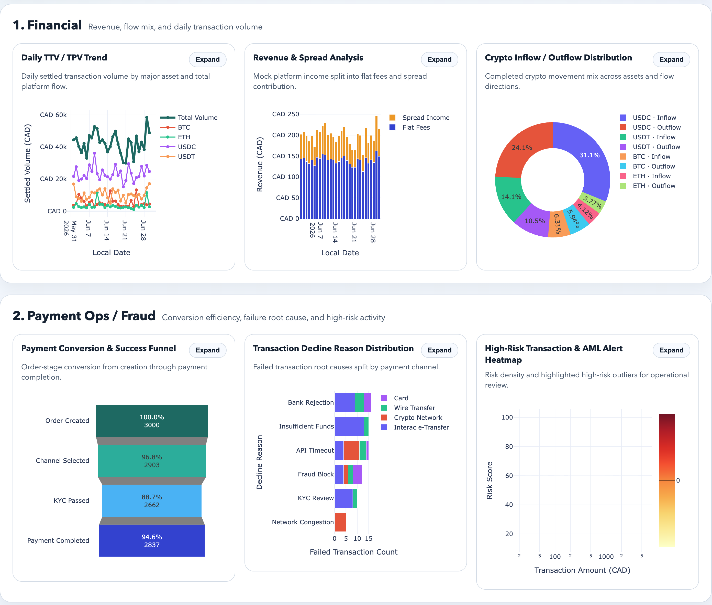
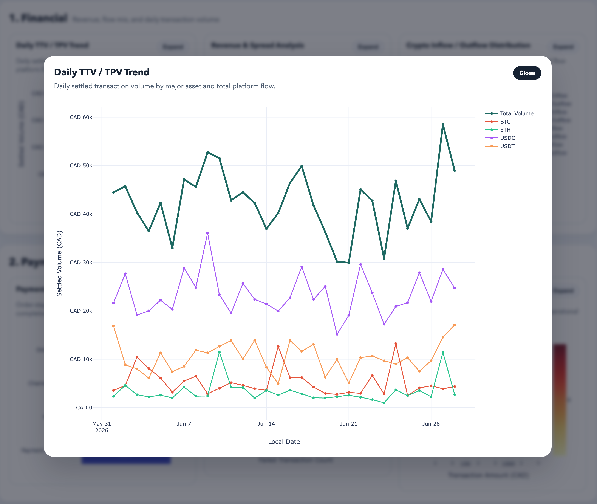
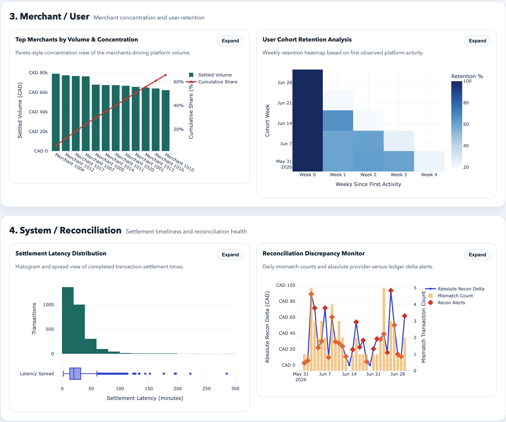

# Crypto Trade Plot

An extensible Python demo for analyzing crypto payment transactions and generating interactive Plotly reports.

## What This Project Does

This project simulates a lightweight daily reporting workflow for crypto payment transactions:

- generates reproducible mock transaction data
- validates and cleans raw CSV input
- computes daily metrics and anomaly flags
- builds interactive Plotly charts
- exports a standalone offline HTML report

The current version is intentionally designed as a demo build, while keeping the data source and pipeline boundaries ready for a future stable daily-run edition.

## Dashboard Preview



This view shows the top half of the operations dashboard, including the Financial and Payment Ops / Fraud sections with card-based interactive charts.



Each chart card supports an `Expand` action that opens the selected figure in a larger modal for easier inspection and interaction.



The lower half of the dashboard highlights Merchant / User concentration and System / Reconciliation monitoring in the same sectioned layout.

## Project Structure

```text
crypto_trade_plot/
├── config.yaml
├── data/
├── docs/
├── logs/
├── reports/
├── run_daily.py
├── scripts/
├── src/
└── tests/
```

## Setup

Install dependencies:

```bash
python3 -m pip install -r requirements.txt
```

## Generate Mock Data

Generate the default 30-day CSV:

```bash
python3 scripts/generate_mock_data.py
```

Generate a deterministic demo dataset ending on a fixed date:

```bash
python3 scripts/generate_mock_data.py --end-date 2026-06-29 --seed 42
```

## Generate The HTML Report

Run the full pipeline with the default configuration:

```bash
python3 run_daily.py --config config.yaml
```

Generate mock data and build the report in one command:

```bash
python3 run_daily.py --config config.yaml --generate-mock-data --mock-end-date 2026-06-29
```

The pipeline writes:

- a dated file such as `reports/Crypto_Trade_Daily_Report_2026-06-29.html`
- a rolling `reports/Crypto_Trade_Daily_Report_latest.html`
- execution logs in `logs/run_daily.log`

## Test

Run all automated tests:

```bash
python3 -m pytest -q
```

Run only the end-to-end integration test:

```bash
python3 -m pytest tests/test_run_daily_integration.py -q
```

## Configuration

The default `config.yaml` controls:

- CSV input path and local timezone
- analysis window size and invalid-row threshold
- mock data generation options
- anomaly rule thresholds
- report title, file prefix, and scatter sampling
- output and log directories

Command-line arguments can override the main runtime settings without editing the file.

## Next Evolution

The current implementation is ready to evolve toward:

- a PostgreSQL-backed data source
- scheduled execution through Cron or Airflow
- notification delivery through email or Slack
- richer monitoring and structured observability
